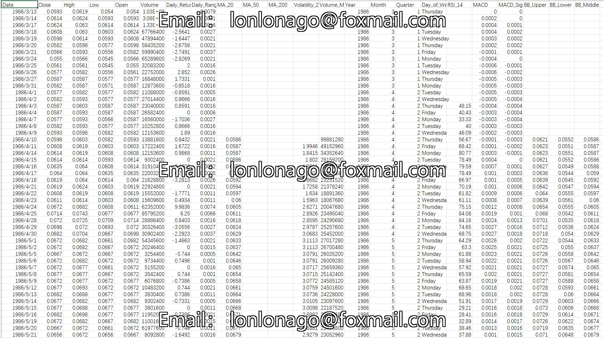

## Body

Microsoft（MSFT）近40年的每日股价历史——从1986年3月13日到2026年3月5日——通过Python库程序化来源于Yahoo Finance。 该数据集专为初学者至中级数据分析师和机器学习从业者设计。原始OHLCV数据经过清理、验证，并加入17项预计算的财务指标，您可以直接进入分析，无需预处理。

数据集中包含：
调整后的收盘价、开盘价、最高价、低价和成交量
移动平均线（20日、50日、200日）
布林带（上、中、下）
RSI（14天相对强弱指数）
MACD及MACD信号线路
日回报率与日价格区间
20天滚动波动率与成交量移动平均
日历分类：年份、月份、季度、星期几

电子虚拟产品售出概不退换

## Images

item_1027027363637

Here is a pay link on Stripe ( https://buy.stripe.com/3cs8yP7sY87d0vu9AB ). Please contact me lonlonago@foxmail.com after funding $89, and I will send you a complete data files , thank you!

